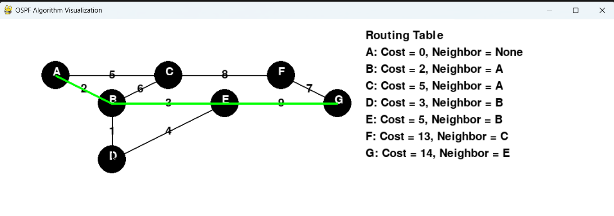

# Interactive OSPF Algorithm Visualization and Shortest Path Simulation

This project implements an interactive **OSPF (Open Shortest Path First) algorithm visualization tool** using Python and Pygame. It allows users to create custom graphs, representing network nodes and connections, and calculates the shortest path between nodes using **Dijkstra's Algorithm**. The tool visually displays the graph, highlights the optimal paths, and dynamically generates routing tables.

## Features
- **Custom Graph Creation**: Add nodes and edges dynamically through user input.
- **Dijkstra's Algorithm**: Calculates the shortest path between any two nodes in the graph.
- **OSPF Simulation**: Visual representation of how OSPF would calculate paths in a network.
- **Interactive Visualization**: Displays graph nodes, edges, costs, and optimal paths in real-time.
- **Dynamic Routing Table**: Shows cost and next-hop neighbor for each node in the network.
- **Path Highlighting**: Visual indication of the shortest path using color-coded lines.

## Technologies Used
- **Python**: For core algorithm implementation and control logic.
- **Pygame**: For graphical visualization of the graph, routing, and pathfinding.

## Requirements
- Python 3.x
- Pygame library

## User Inputs
- **Number of Nodes**: Enter the number of nodes (routers) in the graph.
- **Node Coordinates**: Specify the (x, y) positions for each node.
- **Edges and Costs**: Enter the start and end nodes for each edge along with the distance (cost) between them.
- **Start and End Nodes**: Specify the source and destination nodes for the shortest path calculation.

## Example
Here’s an example of how the program might look once running:

1. Input a graph with 5 nodes and several edges.
2. Calculate the shortest path between two nodes using Dijkstra’s Algorithm.
3. The visual graph will update to show the optimal path and the routing table.

## Output Example

## Acknowledgements
- The Pygame community for their excellent game development framework.
- Various online resources for algorithms and graph theory.

---

Feel free to replace placeholders like `your-username` with your GitHub information and customize the screenshots section accordingly.
